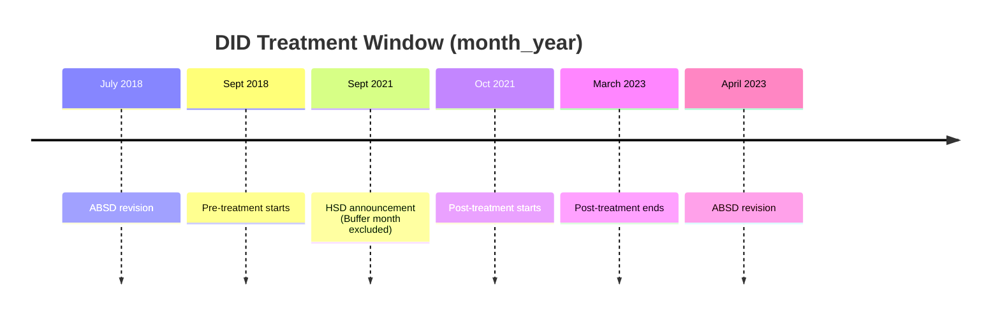

# **Introduction**

## **Background**

*Ministry of National Development (MND)* plays a central role in safeguarding the affordability and stability of the *Housing Development Board* resale market. *ACS's relocation* is slated to potentially affect the prices of homes near it by up to *15%*, which is contrary to our goal of *affordable housing* and highlights the effect of being located near a *"good" school* on housing prices. While *short-term rental* was previously a viable option, since *MOE* introduced the *30-month minimum residency requirement* in *2015*, *HDB resale flats* have become a more practical way to “lock in” eligibility. This motivates our focus on *HDB resale flats*.

## **Problem Statement**

Our analysis hence aims to inform *policy decisions* on the relocation of *"good" schools* and their potential impact on *HDB resale housing affordability* by quantifying the effects of qualifying for the *Phase 2C scheme*.

### **Good School Definition**

The first challenge lies in defining what constitutes a *“good” school*. *Singapore* has no public framework for *school quality*, and detailed indicators such as *academic performance* are not publicly available.

We adopt an *operational definition* tied to the mechanism under study. We define *"good" schools* as those for which access at the *Phase 2C* stage is competitive, indicated by an *admission rate of below 95%*. We use *excess demand* as a *revealed-demand proxy* for *school desirability* within the admissions system.

| Rank | School | Admission Rate |
|-----:|--------|---------------:|
| 1 | TAO NAN SCHOOL | 31.7% |
| 2 | AI TONG SCHOOL | 32.3% |
| 3 | NANYANG PRIMARY SCHOOL | 37.7% |
| 4 | PEI HWA PRESBYTERIAN PRIMARY SCHOOL | 39.2% |
| 5 | METHODIST GIRLS' SCHOOL (PRIMARY) | 40.7% |
| 6 | NAN CHIAU PRIMARY SCHOOL | 41.2% |
| 7 | CHIJ ST. NICHOLAS GIRLS' SCHOOL | 41.7% |
| 8 | CHIJ PRIMARY (TOA PAYOH) | 44.6% |
| 9 | RED SWASTIKA SCHOOL | 47.6% |
| 10 | KONG HWA SCHOOL | 49.0% |
| 11 | ANGLO-CHINESE SCHOOL (JUNIOR) | 49.2% |
| 12 | MAHA BODHI SCHOOL | 50.0% |
| 13 | HOLY INNOCENTS' PRIMARY SCHOOL | 50.0% |
| 14 | ST. JOSEPH'S INSTITUTION JUNIOR | 50.6% |
| 15 | CHONGFU SCHOOL | 51.3% |
| 16 | NAN HUA PRIMARY SCHOOL | 52.5% |
| 17 | ANGLO-CHINESE SCHOOL (PRIMARY) | 54.1% |
| 18 | CATHOLIC HIGH SCHOOL | 57.1% |
| 19 | MARIS STELLA HIGH SCHOOL | 58.5% |
| 20 | ROSYTH SCHOOL | 64.5% |
| 21 | PEI CHUN PUBLIC SCHOOL | 65.6% |
| 22 | FAIRFIELD METHODIST SCHOOL (PRIMARY) | 66.7% |
| 23 | RULANG PRIMARY SCHOOL | 66.7% |
| 24 | NORTHLAND PRIMARY SCHOOL | 69.0% |
| 25 | ST. HILDA'S PRIMARY SCHOOL | 69.0% |
| 26 | PRINCESS ELIZABETH PRIMARY SCHOOL | 71.4% |
| 27 | SINGAPORE CHINESE GIRLS' PRIMARY SCHOOL | 74.1% |
| 28 | SOUTH VIEW PRIMARY SCHOOL | 76.9% |
| 29 | FRONTIER PRIMARY SCHOOL | 87.0% |
| 30 | KUO CHUAN PRESBYTERIAN PRIMARY SCHOOL | 93.8% |

# Data
## HDB Resale Transactions

HDB resale flat transaction data are sourced from data.gov and recorded at the **month-year level**. Each observation represents an **individual resale transaction**. Exact unit identification is not possible as unit numbers are unavailable. Repetitive variables were dropped where appropriate.

| Category | Variables |
|---|---|
| Transaction details | `month`, `resale_price` |
| Location | `town`, `block`, `street_name` |
| Flat characteristics | `flat_type`, `storey_range`, `floor_area_sqm`, `flat_model` |
| Lease information | `remaining_lease` |

Address-level coordinates were retrieved from the OneMap API and transformed to **EPSG:3414** for standardised downstream distance calculations.

## Primary Schools
The MOE school directory from data.gov was the base dataset for primary school information.
As the analysis requires schools to be linked consistently across time and space, we cleaned the raw records into a longitudinal geospatial dataset spanning 2014 to 2026. The main steps are summarised below.

Each school-year observation is matched to relevant education-related URA Planning Area Land Use polygon from data.gov based on the corresponding master plan period.

| Period | URA Land Use dataset |
|:---:|:---:|
| 2014-2018 | **MasterPlan2014** |
| 2019-2024 | **MasterPlan2019** |
| 2025-2026 | **MasterPlan2025** |

## Amenities
<!--
### Shopping Malls
We compiled a list of Singapore shopping malls from Kaggle and Wikipedia, manually verifying identities and opening/closing dates. Temporarily closed malls were treated as continuously open. Unconventional “malls” (e.g., Bencoolen MRT Station retail strip) were retained due to potential price effects. Coordinates were obtained from the OneMap API.

### MRT and LRT stations
Rail data were obtained from a GeoJSON file of MRT and LRT station exits from data.gov.sg. Records were deduplicated to one per station, with invalid entries removed and names standardised.

Opening dates were assigned manually; stations opened before 2014 were set to 1 January 2013, as exact dates are not material. Stations were mapped to rail lines, and coordinates transformed to `EPSG:3414` for distance-based analysis.
--> 

### Shopping Malls

Mall records were compiled, validated, and geocoded to capture their potential influence on prices.

### MRT/LRT 

Rail station data were cleaned, standardised, dated, and projected for distance-based analysis.

# Methodologies

We employ two experimental designs:

1. Regression Discontinuity Design (RDD)
2. Differences in Differences (DID) 

RDD utilises the standing 1km Phase 2C threshold as a natural model threshold, while DID exploits MOE’s September 2021 HSD revision. Because these methods naturally use different data, comparing their results helps assess whether the findings are robust across methods. The two designs also map closely onto informing policy: RDD speaks to the effect of the existing admissions boundary, while DID informs the likely price impact of boundary-changing reforms and, by extension, school relocations.

## 1. RDD

### Overall Model

We implement a sharp RDD at the 1km cutoff. Our baseline specification is a local-linear RDD:

Treatment is defined as:

Crossing the cutoff deterministically changes whether the flat is classified as inside or outside the priority zone.

Treatment assignment is period-aware: transactions before 2022 are classified using the historical point-based rule, while transactions from 2022 onward are classified using the polygon-based rule. 

For good-school specification, analysis focuses on access to good schools changing from 0 to 1.

We also exclude observations where the inside-outside comparison overlaps with another nearby school boundary and the resulting price jump cannot not be cleanly attributed to the focal cutoff.

Estimation is implemented by weighted least squares with triangular kernel weights:

where \(h\) is the bandwidth. This gives the greatest weight to transactions closest to the boundary and progressively downweights observations farther away.

The main specification uses a 100m bandwidth, while 25m is used as a tighter robustness branch. 

#### Pooled and School-Level Model 
We first estimate a pooled model, then construct separate models for each good school to account for heterogeneous effects across schools.

To avoid interpreting very thin local comparisons, a cell is treated as estimable only if it contains at least 50 total observations and at least 20 observations on each side of the cutoff.

#### School x Quadrant 
The cutoff is not a straight border as in conventional RDDs, but a ring around the school -- two flats can be equally close to the same 1km boundary but have vastly different local characteristics, violating the RDD premise that the only significant difference between flats at the border is qualifying for Phase 2C. Estimating within school-quadrant cells restricts the comparison to same directional segments and location area of the boundary, which makes the identifying comparison tighter. 

<em>Figure 1 : Illustration of RDD with flats restricted to within 100m of 1km boundary</em>

#### School x Flat_Type
Finally, we estimate the same design by `school × flat_type` as another level of heterogeneity analysis. The 100m sample is partitioned by flat type to assess whether capitalization of school access differs across market segments. 

### Normal Primary Schools 
To estimate the effect of a normal primary school, the same RDD pooled model was run at 100m and 25m. 

## 2. DID

### Overview

We exploit **MOE’s September 2021 announcement** of revising calculation of **HSD**.

Prior to **September 2021**, **HSD** was measured from a fixed point within the school. From the **2022 P1 Registration Exercise** onwards, it is measured from the **School Land Boundary (SLB)**, thereby bringing more homes within the **1km** and **2km priority bands** (see *Figure 2* below).

  

<em>Figure 2 : Illustration for change in calculation for HSD (Image credit: MOE)</em>

The announcement provides a clean identification setting by generating plausibly exogenous variation in **school admission eligibility**. Some housing units are reclassified from outside to within the **priority cutoff** without any change in location or neighbourhood characteristics due to policy change. These units form the **treated group**, while comparable units that remain outside serve as **controls**. Comparing resale price changes **before and after the announcement** across these groups identifies the causal effect of admission priority on housing prices, subject to the identifying assumptions of the respective **DID estimator**.

For completeness, we implement this for both **good** and **normal schools**. For **good schools**, the main focus of the analysis, we estimate both an **school-level specification** and a **pooled specification**. The school-level specification estimates treatment effects separately for each focal school, while the pooled specification stacks observations across schools to recover an **average effect**. For **normal schools**, we estimate only the pooled specification, as the substantially larger number of schools makes school-level estimation impractical. 

Since **treatment status** is defined relative to **school-specific boundaries**, **sample construction** differs across these specifications, as discussed below.

### Treatment Window

The DID window spans September 2018 to March 2023, excluding September 2021 as a buffer. The sample is bounded to avoid overlap with the July 2018 and April 2023 ABSD revisions, which may induce differential price movements across groups (e.g., first-time Singaporean buyers were unaffected, unlike others).

### Specification

The empirical specification is shared across the **pooled** and **school-level** designs. It is given by:

### Sample Construction

Sample construction is carried out separately for the **school-level** and **pooled** specifications, and within each for **1km** and **2km** bands.

`time` is indexed at`year_quarter` level, and unit is defined by `flat_type`to avoid excessive sparsity in the data while remaining consistent with HDB’s reporting convention. For **1-to-2 school** analysis, the unit is defined as `flat_type × pre_treatment_focal_school` instead. These are done to control heterogenity across units.

**Treatment assignment**

Treatment is defined relative to the priority cutoff, restricting to units gaining exactly one focal school. This allows interpretation of the estimated effect as the causal effect of access to an additional school.

For both **school-level** and **pooled** specifications, treated are defined within corresponding local bands:

For **school-level** specifications, controls are defined likewise:

We hold exposure to schools of the opposite type constant: in the good-school specification, we exclude observations where the number of normal schools from 0-2km changes to reduce heterogenity within controls.

Rest of sample-construction details for the pooled model are in Appendix.

### Robustness checks

**Parallel Trends Test**

For **school-level estimates**, we test the parallel trends assumption using an **event-study specification** estimated on the exact **DID sample** for each focal school. With **2021Q3** \(k = -1\) as the omitted baseline, we conduct a joint **F-test** of the null that all earlier pre-treatment lead coefficients \(k < -1\) are zero. Failure to reject supports the **parallel trends assumption**. This yields up to 12 full leads, plus a partial 2018Q3 lead where observed. 

For **pooled estimates**, we use a **pre-period-only regression** with **treated × quarter** interactions and **flat type fixed effects**, clustering standard errors at the **flat type** level. We then test whether all treated-by-quarter pre-period interactions are jointly zero.

**Anticipation Effects**

For selected schools, we test for **anticipation effects** using a joint **F-test** on the pre-treatment lead coefficients from the anticipation specification. Rejection of the null suggests **pre-policy price adjustment**, while failure to reject indicates **limited evidence of anticipation**.

># Assumptions
We assumed that observable locational controls, such as proximity to MRT stations and shopping malls, capture most neighbourhood characteristics.
# Results

As the dependent variable is in logarithmic, the discontinuity is reported both as the estimate coefficient \($\tau$\) and its implied percentage effect \($\exp(\tau)-1$\). Standard errors are heteroskedasticity-robust (HC1).
## RDD

### Pooled RDD

Pooled RDD estimates at both bandwidths are modest, statistically significant and directionally consistent -- suggesting that qualifying for Phase 2C (1km) of a good school is not associated with a premium.

| Bandwidth | Tau | % effect | p-value | Sample, inside / outside |
|---|---:|---:|---:|---:|
| 100m | -0.0057 | -0.57% | 0.023 | 19,756, 9,478 / 10,278 |
| 25m | -0.0120 | -1.19% | 0.023 | 5,489, 2,531 / 2,958 |

### School-Level Results

Running RDD models at the school level reveals heterogeneity between schools. At 100m,`23` school-level models were estimable;`4` significant at the 5% level. The 25m branch has `18` estimable school models; `6` significant at the 5% level. 

The significant school-level results are mixed in sign: some schools exhibit positive boundary effects, while others show negative effects, suggesting that the pooled estimate is averaging across substantively different effects rather than capturing a common school-boundary response.

| School | 100m Coef. | 100m % effect | 100m n (in/out) | 100m p-value | 25m Coef. | 25m % effect | 25m n (in/out) | 25m p-value |
|---|---:|---:|---:|---:|---:|---:|---:|---:|
| KONG HWA SCHOOL | 0.0361*** | 3.68% | 702 (346/356) | 0.003 | 0.0450 | 4.61% | 217 (126/91) | 0.369 |
| RED SWASTIKA SCHOOL | 0.0210*** | 2.12% | 1254 (556/698) | 0.004 | 0.0569*** | 5.85% | 441 (203/238) | 0.001 |
| FRONTIER PRIMARY SCHOOL | -0.0216** | -2.13% | 1074 (541/533) | 0.022 | 0.0019 | 0.19% | 352 (228/124) | 0.914 |
| SOUTH VIEW PRIMARY SCHOOL | 0.0094** | 0.95% | 1795 (843/952) | 0.045 | 0.0307*** | 3.12% | 485 (235/250) | 0.007 |
| PRINCESS ELIZABETH PRIMARY SCHOOL | -0.0133* | -1.32% | 1336 (662/674) | 0.056 | 0.0124 | 1.25% | 441 (209/232) | 0.631 |
| FAIRFIELD METHODIST SCHOOL (PRIMARY) | -0.2507* | -22.17% | 283 (150/133) | 0.079 | Insufficient data | -- | -- | -- |
| RULANG PRIMARY SCHOOL | 0.0061 | 0.61% | 1036 (474/562) | 0.368 | 0.0636*** | 6.56% | 409 (114/295) | 0.0001 |
| NAN CHIAU PRIMARY SCHOOL | 0.0038 | 0.38% | 1749 (758/991) | 0.482 | 0.0442*** | 4.52% | 465 (233/232) | 0.0001 |
| PEI CHUN PUBLIC SCHOOL | 0.0084 | 0.84% | 667 (187/480) | 0.656 | -0.1469** | -13.66% | 149 (38/111) | 0.014 |
| HOLY INNOCENTS' PRIMARY SCHOOL | 0.0109 | 1.09% | 890 (416/474) | 0.322 | 0.1069** | 11.28% | 268 (134/134) | 0.036 |

### Balance Diagnostics: SMD and TVD

To assess whether significant results genuinely reflect the price premium rather than compositionally mismatched cells, we report two balance diagnostics: standardized mean differences (SMD) for numeric covariates and total variation distance (TVD) for categorical distributions. SMD measures the gap between inside and outside means. Values closer to zero indicate that houses on both sides have similar traits such as floor_area or n_amenities. TVD measures the difference in categorical distributions across both sides, ranging from `0` for identical distributions to `1` for complete separation.

These diagnostics are mainly included as a robustness screen for the subgroup analyses. In thinner cells, a statistically significant coefficient can still arise because the inside and outside observations differ materially in year composition, flat mix, or other local characteristics instead of reflecting the good school effect. SMD and TVD help determine which subgroup results are supported by reasonably like-for-like comparisons and which are more likely due to mismatch. 

### Flat-Type Heterogeneity

`66` school-flat-type models were estimable, with `13` significant at the 5% level. For some schools, the effect appears concentrated in specific flat segments; for others, it is absent or changes sign across types.

| School | Overall | 2 ROOM | 3 ROOM | 4 ROOM | 5 ROOM | EXECUTIVE |
|---|---:|---:|---:|---:|---:|---:|
| CHONGFU SCHOOL | 0.0107 1.07% | insufficient data 1.15 / 0.91 | 0.0131 1.32% 0.29 / 0.34 | 0.0149 1.50% 0.28 / 0.24 | 0.0312* 3.17% 0.56 / 0.37 | insufficient data — / 0.50 |
| FAIRFIELD METHODIST SCHOOL (PRIMARY) | -0.2507* -22.17% | insufficient data — / 0.50 | -0.5798 -44.00% 0.55 / 0.41 | 3.1659** 2271.04% 10.39 / 0.94 | insufficient data 5.84 / 0.61 |  |
| FRONTIER PRIMARY SCHOOL | -0.0216** -2.13% |  | insufficient data 1.43 / 1.00 | 0.0099 0.99% 0.56 / 0.32 | -0.0538*** -5.24% 0.44 / 0.29 | 0.0034 0.35% 0.74 / 0.52 |
| HOLY INNOCENTS' PRIMARY SCHOOL | 0.0109 1.09% |  | 0.1045*** 11.02% 0.77 / 0.51 | 0.0170 1.71% 0.34 / 0.25 | 0.0408 4.16% 0.42 / 0.41 | 0.5924* 80.84% 1.91 / 0.86 |
| KONG HWA SCHOOL | 0.0361*** 3.68% | -1.0545 -65.16% 3.35 / 1.00 | 0.0783*** 8.15% 0.35 / 0.36 | 0.1634** 17.75% 0.51 / 0.51 | -0.1589 -14.69% 1.28 / 0.65 | insufficient data — / 0.50 |
| NAN CHIAU PRIMARY SCHOOL | 0.0038 0.38% | 0.0596** 6.14% 0.75 / 0.37 | -0.0203 -2.01% 1.54 / 0.40 | 0.0193*** 1.95% 0.72 / 0.41 | -0.0020 -0.20% 0.77 / 0.32 | -0.0423 -4.14% 0.89 / 0.67 |
| NORTHLAND PRIMARY SCHOOL | -0.0042 -0.42% |  | 0.0231** 2.34% 0.60 / 0.49 | -0.0031 -0.31% 0.46 / 0.24 | -0.0292 -2.88% 0.66 / 0.35 | 0.0118 1.19% 1.56 / 0.46 |
| PEI CHUN PUBLIC SCHOOL | 0.0084 0.84% |  | 0.0115 1.15% 0.56 / 0.55 | 0.0921*** 9.65% 3.19 / 0.65 | insufficient data 1.75 / 0.71 | insufficient data 4.75 / 1.00 |
| PRINCESS ELIZABETH PRIMARY SCHOOL | -0.0133* -1.32% | 0.0927 9.71% 2.07 / 0.73 | 0.0261* 2.65% 0.61 / 0.38 | -0.0135 -1.34% 0.18 / 0.26 | 0.0259* 2.62% 0.62 / 0.30 | 0.3733*** 45.26% 0.83 / 0.54 |
| RED SWASTIKA SCHOOL | 0.0210*** 2.12% | insufficient data — / 0.50 | 0.0159 1.61% 0.41 / 0.34 | -0.0231* -2.28% 0.86 / 0.35 | -0.0340 -3.35% 1.33 / 0.64 | insufficient data 1.57 / 0.76 |
| ROSYTH SCHOOL | 0.0035 0.35% | insufficient data — / 0.50 | 0.0063 0.63% 1.05 / 0.42 | 0.0172* 1.73% 0.94 / 0.33 | -0.0254** -2.51% 0.50 / 0.40 | insufficient data — / 0.50 |
| RULANG PRIMARY SCHOOL | 0.0061 0.61% | insufficient data 0.98 / 0.67 | -0.0244* -2.41% 3.00 / 0.68 | 0.0062 0.62% 1.28 / 0.45 | 0.0148 1.49% 2.82 / 0.80 | insufficient data 1.65 / 0.62 |
| SOUTH VIEW PRIMARY SCHOOL | 0.0094** 0.95% | insufficient data — / 0.50 | -0.0186 -1.84% 1.31 / 0.53 | 0.0016 0.16% 0.40 / 0.25 | 0.0207*** 2.09% 0.47 / 0.29 | -0.0000 -0.00% 1.85 / 0.86 |
| ST. HILDA'S PRIMARY SCHOOL | 0.0072 0.72% | insufficient data 2.49 / 0.67 | 0.0534 5.49% 0.72 / 0.40 | 0.0162* 1.63% 0.37 / 0.26 | -0.0202** -2.00% 0.24 / 0.32 | -0.0450 -4.40% 0.48 / 0.71 |

Flat-type cells are shown as coefficient on the first line, percentage effect on the second line and max SMD / max TVD on the third line. 

Comparing SMD and TVD, we distinguish more plausible flat-type heterogeneity from obvious blow-up cells. Extreme coefficients are again paired with weak comparability. Fairfield `4 ROOM`, has `tau = 3.1659` with `max |SMD| = 10.39` and `max TVD = 0.94`. 

There is no clear trend of changes in effect as flat types get larger which suggests that the price premium effect on good schools may not be limited to specific price tiers of flats. 

---
School-by-quadrant results and discussion are in Appendix. 

## DID 
## Overall
### Pooled DID (0 -> 1 good school in 1km radius)
Pre-trends fail (p = 0.0257), and the DID estimate is statistically insignificant (-0.0024; t = -0.177), likely due to high control-group heterogeneity. We therefore turn to the school-level DID analysis.
### School-Level Results (0 -> 1 good school in 1km radius)

A total of `21` school-level models were estimable.`8` passed the parallel trends test; `5` were significant at the 5% level.

| School | DID Coef | DID % Effect | Pre Trend p-value | p-value | Treated Pre | Treated Post | Control Pre | Control Post |
|---|---:|---:|---:|---:|---:|---:|---:|---:|
| ROSYTH SCHOOL | 0.000958 | 0.10% | 1.00e+00 | 9.55e-01 | 35 | 26 | 480 | 238 |
| ST. HILDA'S PRIMARY SCHOOL | 0.045065*** | 4.61% | 9.98e-01 | 9.02e-31 | 27 | 20 | 510 | 288 |
| PEI CHUN PUBLIC SCHOOL | 0.041044*** | 4.19% | 7.60e-01 | 3.05e-11 | 29 | 7 | 437 | 410 |
| RULANG PRIMARY SCHOOL | 0.040291** | 4.11% | 6.35e-01 | 1.52e-02 | 71 | 44 | 505 | 258 |
| FAIRFIELD METHODIST SCHOOL (PRIMARY) | 0.064738* | 6.69% | 1.57e-01 | 5.50e-02 | 37 | 30 | 967 | 465 |
| CHONGFU SCHOOL | 0.019599** | 1.98% | 1.33e-01 | 1.22e-02 | 92 | 90 | 386 | 287 |
| CHIJ PRIMARY (TOA PAYOH) | 0.074569*** | 7.73% | 1.25e-01 | 6.09e-14 | 10 | 9 | 168 | 172 |
| MAHA BODHI SCHOOL | -0.024024 | -2.37% | 6.03e-02 | 6.10e-01 | 51 | 41 | 677 | 431 |

Estimates are generally positive at `4–6%`, suggesting continued capitalisation of good-school proximity into HDB resale prices, with slight variation across schools reflecting differences in perceived school quality and housing demand.

### Anticipation Effects

To ensure robustness, these `8` schools were tested for anticipation effects. Except for `Rosyth School`, we find no evidence of pre-policy behavioural change.

| school_name                          | n_treated_pre | n_treated_post | n_control_pre | n_control_post | lead_p |
| ------------------------------------ | ------------: | -------------: | ------------: | -------------: | -----: |
| ST. HILDA'S PRIMARY SCHOOL           |            27 |             20 |           510 |            288 | 1.0000 |
| PEI CHUN PUBLIC SCHOOL               |            29 |              7 |           437 |            410 | 0.1904 |
| RULANG PRIMARY SCHOOL                |            71 |             44 |           505 |            258 | 1.0000 |
| FAIRFIELD METHODIST SCHOOL (PRIMARY) |            37 |             30 |           967 |            465 | 1.0000 |
| CHONGFU SCHOOL                       |            92 |             90 |           386 |            287 | 1.0000 |
| CHIJ PRIMARY (TOA PAYOH)             |            10 |              9 |           168 |            172 | 0.1143 |
| MAHA BODHI SCHOOL                    |            51 |             41 |           677 |            431 | 0.0690 |

### School-Level Results (0 -> 1 good school in 1-2km radius)

We explored individual DID models for flats that gained access to 1 good school in the 2km radius. A total of `21` school-level models were estimable; `9` passed the parallel trends test. `3` were significant at the 5% level.

| School | DID Coefficient | Parallel Trend p-value | p-value | Treated Pre | Treated Post | Control Pre | Control Post |
|---|---:|---:|---:|---:|---:|---:|---:|
| NAN CHIAU PRIMARY SCHOOL | 0.008299 | 1.00e+00 | 2.78e-01 | 121 | 82 | 1146 | 550 |
| CATHOLIC HIGH SCHOOL | 0.010614 | 6.60e-01 | 6.70e-01 | 68 | 90 | 193 | 98 |
| CHONGFU SCHOOL | -0.008332 | 6.54e-01 | 3.34e-01 | 41 | 29 | 776 | 600 |
| HOLY INNOCENTS' PRIMARY SCHOOL | 0.018057** | 3.71e-01 | 9.62e-03 | 59 | 22 | 391 | 176 |
| KONG HWA SCHOOL | 0.050093** | 3.39e-01 | 1.21e-02 | 40 | 23 | 488 | 247 |
| ST. JOSEPH'S INSTITUTION JUNIOR | -0.025256 | 1.31e-01 | 4.11e-01 | 40 | 19 | 118 | 43 |
| FRONTIER PRIMARY SCHOOL | -0.024439 | 8.33e-02 | 6.65e-01 | 41 | 48 | 280 | 214 |
| AI TONG SCHOOL | -0.022567** | 6.68e-02 | 2.10e-02 | 61 | 26 | 201 | 101 |
| MAHA BODHI SCHOOL | -0.019474 | 5.99e-02 | 5.48e-01 | 3 | 2 | 459 | 294 |

Results for gaining another good school in the 2km radius were expectedly more ambiguous, with Holy Innocents’ Primary School and Kong Hwa School reporting positive estimates but Ai Tong School exhibiting a negative effect.

---
DID results for flats going from 1 to 2 good schools are in Appendix.

## Comparing RDD and DID 

### Pooled 

We observe that the pooled estimate for both good and normal schools across methods and bandwidths share negative coefficients of similar magnitude.

#### Good Schools
| Method | Specification | Parallel Trend Test | Estimate | % effect | Main p-value |
|---|---|---|---:|---:|---:|
| RDD | 100m bandwidth | -- | -0.0057 | -0.57% | 0.023 |
| RDD | 25m bandwidth | -- | -0.0120 | -1.19% | 0.023 | 
| DiD | Matched 200m sample | Failed | -0.0024 | -0.24% | 0.860 |

#### Normal Schools

| Method | Specification | Parallel Trend Test | Estimate | %effect | Main p-value |
|---|---|---|---:|---:|---:|
| RDD | 100m bandwidth | -- | -0.0307 | -3.02% | 2.25e-11 |
| RDD | 25m bandwidth | -- | -0.0182 | -1.80% | 0.131 | 
| DiD | Matched 200m sample | Failed | -0.0074 | -0.74% | 0.035

### School-level
Comparing RDD and DID estimates for individual schools at 1km, we note that for most schools, significant coefficients share similar signs and magnitude which lends credibility to the robustness of our estimates. 

However, `Pei Chun Public School` had significant but opposite sign estimates between the DID and RDD approaches. Referring back to the SMD and TVD analysis on school-quadrant analysis, we note that `Pei Chun SE` estimate was -0.0531**	 but `Peichun SW` is 0.0938**, and importantly that `Pei Chun SE` has poor balance in flat characteristics -- `max |SMD| = 1.42 and max TVD = 0.87`. This  suggests that the RDD negative estimate for Pei Chun could likely be due to imbalance in flat characteristics across the boundary instead of the school effect. Thus, the DID estimate for Pei Chun is likely to be a better estimate.  

| School | Parallel Trend | DID Coef | DID p-value | 100m Coef. | 100m n (in/out) | 100m p-value | 25m Coef. | 25m n (in/out) | 25m p-value |
|---|---|---:|---:|---:|---:|---:|---:|---:|---:|
| ST. HILDA'S PRIMARY SCHOOL | Pass | 0.045065*** | 9.02e-31 | 0.0072 | 1229 (631/598) | 0.252 | 0.0267 | 366 (192/174) | 0.174 |
| PEI CHUN PUBLIC SCHOOL | Pass | 0.041044*** | 3.05e-11 | 0.0084 | 667 (187/480) | 0.656 | -0.1469** | 149 (38/111) | 0.014 |
| RULANG PRIMARY SCHOOL | Pass | 0.040291** | 1.52e-02 | 0.0061 | 1036 (474/562) | 0.368 | 0.0636*** | 409 (114/295) | 0.0001 |
| FAIRFIELD METHODIST SCHOOL (PRIMARY) | Pass | 0.064738* | 5.50e-02 | -0.2507* | 283 (150/133) | 0.079 | Insufficient data | -- | -- |
| CHONGFU SCHOOL | Pass | 0.019599** | 1.22e-02 | 0.0107 | 1571 (866/705) | 0.149 | -0.0237 | 251 (132/119) | 0.506 |
| CHIJ PRIMARY (TOA PAYOH) | Pass | 0.074569*** | 6.08e-14 | 0.0206 | 264 (150/114) | 0.447 | Insufficient data | -- | -- |
| KONG HWA SCHOOL | Fail | -- | -- | 0.0361*** | 702 (346/356) | 0.003 | 0.0450 | 217 (126/91) | 0.369 |
| RED SWASTIKA SCHOOL | Fail | -- | -- | 0.0210*** | 1254 (556/698) | 0.004 | 0.0569*** | 441 (203/238) | 0.001 |
| FRONTIER PRIMARY SCHOOL | Fail | -- | -- | -0.0216** | 1074 (541/533) | 0.022 | 0.0019 | 352 (228/124) | 0.914 |
| SOUTH VIEW PRIMARY SCHOOL | Fail | -- | -- | 0.0094** | 1795 (843/952) | 0.045 | 0.0307*** | 485 (235/250) | 0.007 |
| PRINCESS ELIZABETH PRIMARY SCHOOL | Fail | -- | -- | -0.0133* | 1336 (662/674) | 0.056 | 0.0124 | 441 (209/232) | 0.631 |
| NAN CHIAU PRIMARY SCHOOL | Fail | -- | -- | 0.0038 | 1749 (758/991) | 0.482 | 0.0442*** | 465 (233/232) | 0.0001 |
| HOLY INNOCENTS' PRIMARY SCHOOL | Fail | -- | -- | 0.0109 | 890 (416/474) | 0.322 | 0.1069** | 268 (134/134) | 0.036 |

# **Discussions**

## **Overview**

The results suggest that *school-access capitalization* in the HDB resale market is real but uneven. Pooled estimates are weak or negative, but *school-level analyses*—especially *DID estimates* that satisfy *pre-trend checks*—show meaningful premiums in selected catchments, pointing to substantial heterogeneity in how *Phase 2C eligibility* is priced.

The discussion focuses on *two policy implications* of these findings:

### **Good School-Specific Effects**

Across both methods, the pooled estimates do not point to a common premium, while school-level results reveal substantial variation in both sign and magnitude. This suggests that competition for admission is useful but not, on its own, a sufficient predictor of how strongly *Phase 2C access* will be capitalised into nearby *HDB resale prices*. On informing policy, pooled or averaged estimates even among similar good schools are therefore a limited reference to likely housing impacts; *school-specific estimates* are more informative when anticipating the effects of relocation, boundary changes, or admissions adjustments.

### **Equity Safeguards**

Capitalisation of school access into housing prices risks disproportionately disadvantaging *lower-income households* and *younger homeowners*. This is particularly concerning given the absence of a clear declining trend in premiums across flat types: the `school × flat_type` results suggest that estimated effects are heterogeneous, but not concentrated only in either cheaper or more expensive flats. Although some of the largest subgroup coefficients coincide with weak balance and should be interpreted cautiously, the broader pattern indicates that *school-driven premiums* may operate across multiple segments of the HDB market. As *affordable public housing* is a core social objective, policymakers cannot assume that the issue is confined to one buyer group. Measures aimed at preserving affordability in smaller flats should therefore be complemented by efforts to prevent *ceiling-price escalation* and *wealth-based sorting* in larger flats. Hence, *MND* and *MOE* should ensure that admission or relocation policies do not reinforce *socioeconomic sorting* within the public housing system.

# **Limitations**

## **Data Quality**

Some data was manually validated due to the lack of official data sources, which leaves some scope for minor deviations in amenity statuses.

## **Sample Selection**

For some good schools, nearby *HDB resale activity data* is too sparse to support robust local estimation. This is especially important in light of the results: pooled effects are weak, while school-level estimates are clearly heterogeneous, so an overall average is a poor substitute when a school cannot be estimated directly. In those cases, the analysis is less able to provide *school-specific quantifications* and guidance for relocation or admissions decisions.

## **Methodologies**

*RDD* premises on flats just inside and outside the *1 km cutoff* being highly comparable, which the ring boundary violates. *Quadrant splits* and *balance diagnostics* tighten comparison but not perfectly -- pushing the design further to absorb every local permutation would strengthen identification of the effect in theory, but requires much more data than current and has
weaker general interpretability.

For *DID*, causal interpretation depends on credible *pre-trends*, with *synthetic-DID* used to craft a pre-trend. However, missing observations in parts of the pre-period for many schools (with several otherwise usable school samples) led to a relatively low number of estimated models.

# **Future Works**

A natural next step is to move from documenting to explaining heterogeneity. Identifying *school* and *neighbourhood-level features* that drive differences in capitalisation would help policymakers anticipate where admissions changes may generate price pressures, and make grouped or proxy estimates more defensible for schools with sparse nearby *HDB transactions* that cannot be directly estimated.

A second extension is to test whether access to multiple *sought-after schools* carries an additional premium, as households may value choice as well, beyond access.

# **Conclusion**

Using *RDD* and *DID*, we find that *Phase 2C admission eligibility* can be capitalised into *HDB resale prices*, but not as a uniform market-wide premium. The strongest evidence points to localized and heterogeneous effects across catchments, implying that admissions rules, boundary changes and school relocations can generate localized affordability pressures. *MND* and *MOE* should therefore assess such interventions jointly, crucially using *school-specific* rather than pooled estimates.